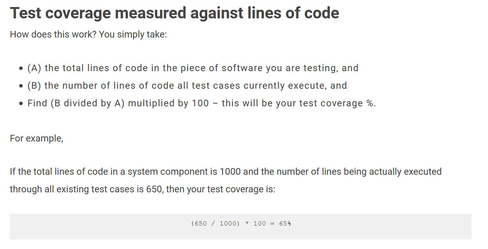

# QAFinalAssignment

## Scrum
### Sprint Backlog

| Task | Story Points | Progress |
| --- | :---: | :---: |
| Create Classes | 1 | Done |
| Implement CRUD Method for Survey | 2 | Done |
| Implement CRUD Methods for SurveyResponse | 2 | Done |
| Implement Calculations Methods on Survey Answers | 2 | Done |
| Add Test Coverage Metric to Project | 3 | Done |
| Add Team Version Control to Project | 1 | TODO |
| Add Review Checklist to Project | 1 | TODO |
| **Total Story Points for Sprint** | **12** |    |

### Task Estimation

For Story points in the Sprint Backlog I used a points system between 1 and 5 to determine the size and difficulty of each task. 1 being the easiest the 5 being the most difficult. Any task that was a 5 would be broken down into smaller sub tasks, for example developing the code for this project woud have been a 5, but breaking it down into smaller blocks got each task down into a 1 or 2 point task. The tasks with 2 are more difficult than the tasks with 1 as they also involve developing tests for the code implemented. 

## Test Driven Development
Test Driven Development (TDD) is a process of developing code that was used to create this piece of software. TDD is implemented when a developer writes unit tests for the along side the code they are developing, to make sure each method is working as it should. The developer would write a failing test first, then write the method to pass it. Although this process takes a longer time to develop the code it ensures the integrity of the application Also in the future if someone wants to change or refactor the code without breaking the functionality of the whole system, they can run the tests that were already implemented to see of their change didn't break anything. 

## Test Coverage Metric
Test Coverage is the degree of which a test suite covers the application code. To implement this I created unit tests for every method that I created in the Controller class. For each method I would create at least unit tests, one for getting the correct result and anothe for unit test for error handling. I created 35 unit tests for 17 methods.

The Code Coverage tool I decided to use is called Jacoco, however for one reason or another I could not get it to geneate the Test Coverage reports.

 So unfortuantly I could not use to generate test coverage, and had to resort to a more primative way to come up with a result, which I got off the this (website)[https://reqtest.com/testing-blog/test-coverage-metrics/].

Using the above formula, I calculate that the code in which I'm testing (Controller.java + Survey.java + SurveyResponse.java + Question.java) is 280 lines of code. and my ControllerTest.java class is 360 lines of code (This these numbers are leaving out the imports and other non-function lines of code). This gives me a Testing Coverage of 133%. However given the primitive calculation of this I would take the result with a pinch of salt. 

## Team Version Control
To implement Version Control I created a new branch for every task that is in the Scrum backlog. This way I am able to track every change to the prject. All commits would merge with the developer branch first, and make sure everything works and runs as it should, before commiting to master. 

Each Commit would include a discription of what changes it has made to the project. Before a Commit can be merged with another branch, it has to be verified befor the merge is complete. USually this is done by a different developer but as I am the only developer on this project, I request and verify each commit. This link is an example of a commit I did. 
https://github.com/AjiRawlinson/QAFinalAssignment/commit/dbc17afaf8e21e53fe8ff0c0d43b25e6ee3e1b3d

## Code Review Checklist

Below I made a checklist that should be checked for anyone reviewing my code or any code for that matter. If all these 8 points are checked then the reviewer can can give the all clear.

| Review Checklist | :heavy_check_mark: |
| --- | --- |
| Implements Task Requirements |  |
| All tests passing |    |
| All Methods Tested |   |
| Variable Names Accurate |   |
| Efficient Functionality |   |
| Functionality Exception Handling |   |
| Adequate Commenting |   |
| Code Indentation and Formatting |   |
